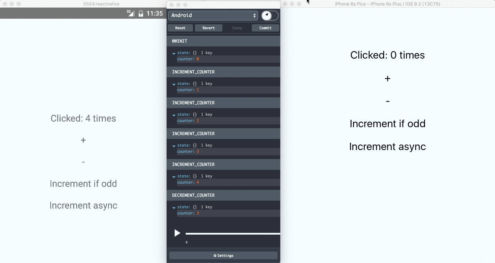

Remote Redux DevTools
=====================



Use [Redux DevTools](https://github.com/gaearon/redux-devtools) remotely for React Native, hybrid, desktop and server side Redux apps.

### Installation

```
npm install --save-dev remote-redux-devtools
```

### Usage

Just [add our store enhancer to your store](https://github.com/zalmoxisus/remote-redux-devtools/commit/eb18fc49e1f083a2330939af52da349b862f8df1):

##### `store/configureStore.js`

```js
import { createStore, applyMiddleware, compose } from 'redux';
import thunk from 'redux-thunk';
import devTools from 'remote-redux-devtools';
import reducer from '../reducers';

export default function configureStore(initialState) {
  const enhancer = compose(
    applyMiddleware(thunk),
    devTools()
  );
  // Note: passing enhancer as last argument requires redux@>=3.1.0
  return createStore(reducer, initialState, enhancer);
}
```

### Remote monitoring

Use one of [our monitor apps](https://github.com/zalmoxisus/remotedev-app) to inspect and redo actions:
- [web](http://remotedev.io/)
- [chrome app](https://chrome.google.com/webstore/detail/remotedev/faicmgpfiaijcedapokpbdejaodbelph) (recommended)
- [electron app](https://github.com/zalmoxisus/remote-redux-devtools/tree/master/install).

The source code is [here](https://github.com/zalmoxisus/remotedev-app).

It is also included in the following projects:

* [redux-devtools-extension](https://github.com/zalmoxisus/redux-devtools-extension) - Also included `remotedev-app`.
* [remotedev-extension](https://github.com/jhen0409/remotedev-extension) - Used in Electron/Browser DevTools.
* [remote-redux-devtools-on-debugger](https://github.com/jhen0409/remote-redux-devtools-on-debugger) - Used in React Native debugger as a dock monitor.
* [atom-redux-devtools](https://github.com/zalmoxisus/atom-redux-devtools) - Used in Atom editor.
* [redux-dispatch-cli](https://github.com/jhen0409/redux-dispatch-cli) - A CLI tool for Redux remote dispatch.

### Communicate via local server

In order to make it simple to use, by default, the module and the monitor app communicate via [remotedev.io](http://remotedev.io) server. Use [remotedev-server](https://github.com/zalmoxisus/remotedev-server) cli to run it locally in order to make the connection faster and not to require an internet connection.


### Parameters

Name                  | Description
-------------         | -------------
`name`                | *String* representing the instance name to be shown on the remote monitor.
`realtime`            | *Boolean* specifies whether to allow communicating with the remote monitor. By default is `process.env.NODE_ENV === 'development'`. 
`hostname`            | *String* used for [`remotedev-server`](https://github.com/zalmoxisus/remotedev-server). If `port` is specified, default value is `localhost`.
`port`                | *Number* used for [`remotedev-server`](https://github.com/zalmoxisus/remotedev-server). Local host's port.
`filters`             | *Map of arrays* named `whitelist` or `blacklist` to filter action types.
`maxAge`              | *Number* of maximum allowed actions to be stored on the history tree, the oldest actions are removed once maxAge is reached. Default is `30`.


All props are optional. You have to provide at least `port` property to use `localhost` instead of `remotedev.io` server.

Example:
```js
export default function configureStore(initialState) {
  // Note: passing enhancer as last argument requires redux@>=3.1.0
  return createStore(
    rootReducer,
    initialState,
    devTools({
      name: 'Android app', realtime: true,
      hostname: 'localhost', port: 8000,
      maxAge: 30, filters: { blacklist: ['EFFECT_RESOLVED'] }
      })
  );
}
```

### Examples
- [Web](https://github.com/zalmoxisus/remote-redux-devtools/tree/master/examples)
- [React Native](https://github.com/zalmoxisus/react-native-counter-ios-android).

### Limitations

- Use it only for development, **NOT in production!**
- The app and the monitor should be under the same external IP address.
- For web apps it's easier and way faster to use [Chrome extension](https://github.com/zalmoxisus/redux-devtools-extension) instead. The remote monitoring is meant to be used for React Native, hybrid, desktop and server side apps. 

### License

MIT
